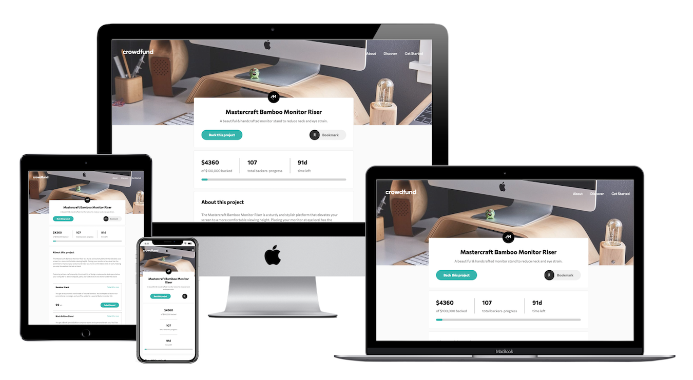
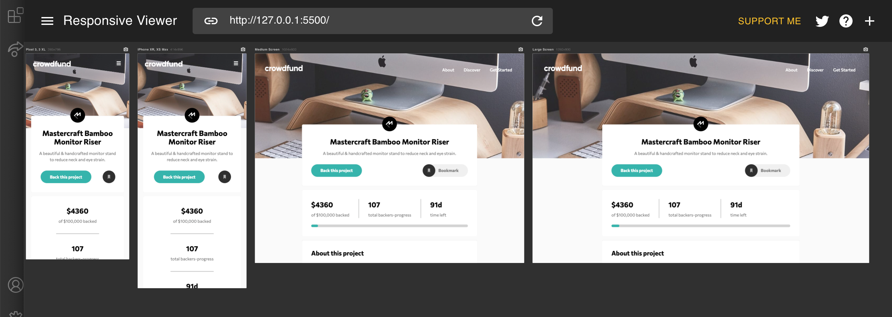
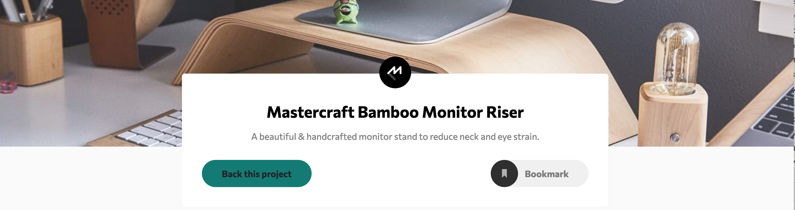
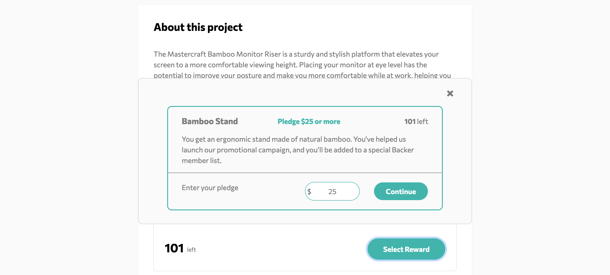
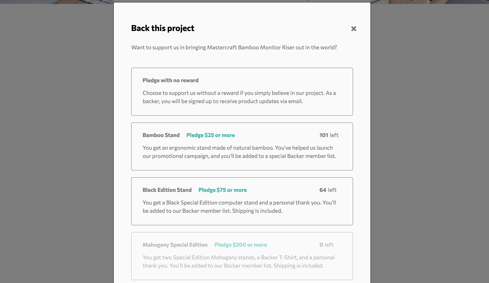
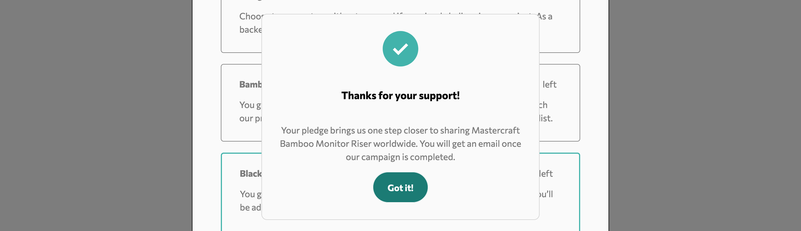
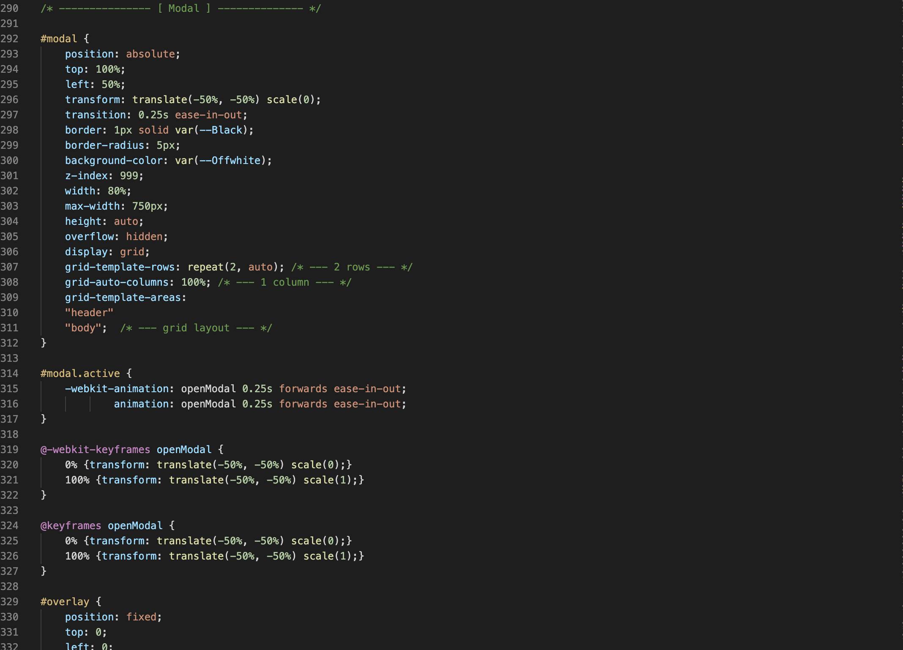
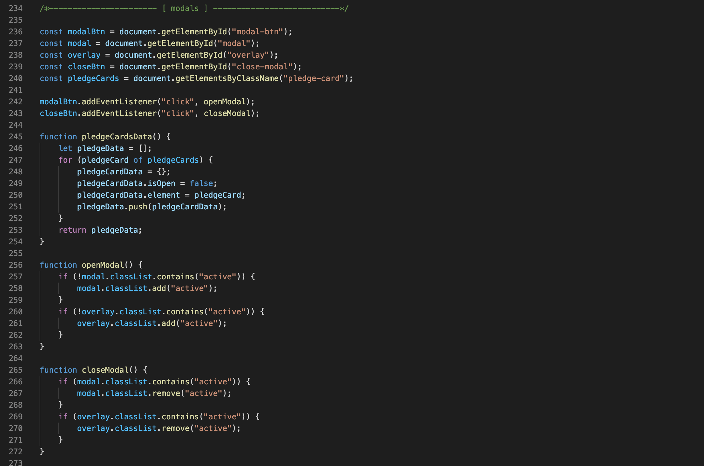
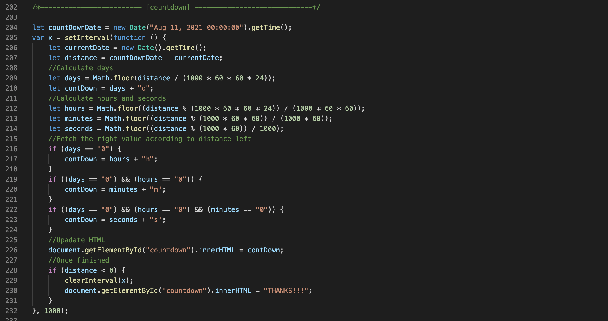
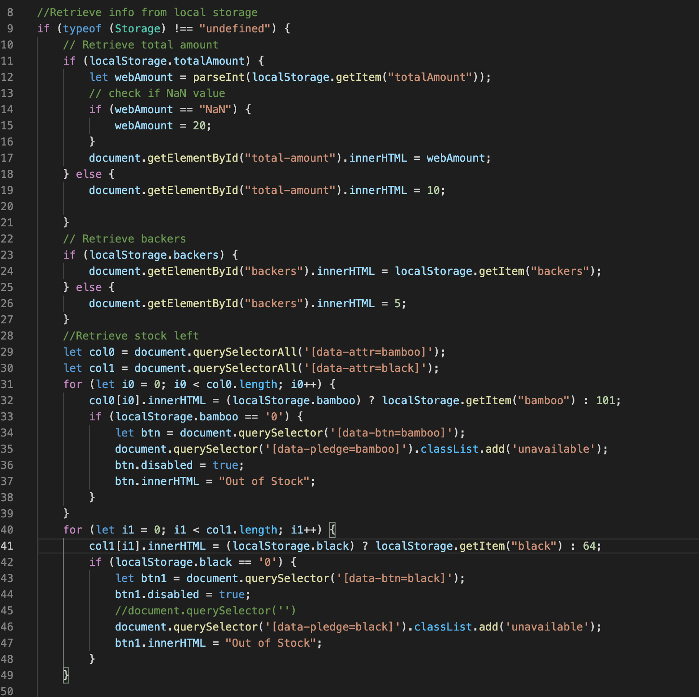

# Frontend Mentor - Crowdfunding product page solution

  This is a solution to the [Crowdfunding product page challenge on Frontend Mentor](https://www.frontendmentor.io/challenges/crowdfunding-product-page-7uvcZe7ZR). Frontend Mentor challenges help you improve your coding skills by building realistic projects. 

  

 - ## **Table of contents**

    - [Overview](#overview)
      - [The challenge](#the-challenge)
      - [Features implemented](#features-implemented)
      - [Links](#links)
    - [My process](#my-process)
      - [Built with](#built-with)
      - [Learning outcomes](#learning-outcomes)
      - [Continued development](#continued-development)
      - [Useful resources](#useful-resources)
    - [Authors](#authors)

 - ## **Overview**

    - ### **The challenge**

      Users should be able to:

      - View the optimal layout depending on their device's screen size
      - See hover states for interactive elements
      - Make a selection of which pledge to make
      - See an updated progress bar and total money raised based on their pledge total after confirming a pledge
      - See the number of total backers increment by one after confirming a pledge
      - Toggle whether or not the product is bookmarked

    - ### **Links**

      - Solution URL: [https://github.com/CodingNovas/crowdfunding-product-page](https://github.com/CodingNovas/crowdfunding-product-page)
      - Live Site URL: [https://codingnovas.github.io/crowdfunding-product-page/](https://codingnovas.github.io/crowdfunding-product-page/)

    - ### **Features implemented**

      - **Responsive design** 

        

      - **Hovering effect on interactive elements** 

        **Default state**
        

        **Hovered state**
        

      - **Toggling whether or not his product is bookmarked** 

        

      - **Updating progress bar, total money raised and the total number of backs** 

        

      - **Selecting pledge and opening modals** 

        **Enter pledge from main page**
        

        **Back this project**
        

        **Pledging from back this project**
        
        **Thank you modals**
        

      - **Out stock items**

        

 - ## **Development process**

    - ### **Built with**

      - Semantic HTML5 markup
      - CSS custom properties
      - Flexbox
      - CSS Grid
      - Bootstrap (for navigation only)
      - Javascript (including local storage)

    - ### Learning outcomes 

      - #### **Group project**

        As a group we have learnt to read, work with & amend others' code.

      - #### **Coding** 

        Each of the members of the group have learnt and explored something new and below are some examples:

        - Kelven  & Mike - implemententation of css grid and modals as a team
   
          **css grid**
          

          **modals**
          
  
        - Carlos - implementation of javascript countdown timer 

          

        - Claire - implementation of local storage

          

    - ### **Continued development**

      As this challenge was a first group project, it has been an excellent learning experience. 

      For next group project, we should focus on:
        - Agreeing beforehand the languages and frameworks used in developing the project, as some compoments such as Bootstrap may inadvertently affect the overall layout of the page.
        - Spending more time beforehand to understand the requirements of the project so that tasks can be split in a more meaningful way.

    - ### **Useful resources**

      - [Tutorial w3school](https://www.w3schools.com/howto/howto_js_countdown.asp) - This helped for to create the countdown timer
      - [CSS Tricks post](https://css-tricks.com/change-color-of-svg-on-hover/) - This helped to change the svg colour when hovered / clicked

  - ## **Authors**

    - [Mike Avgeros](https://github.com/MikeAvgeros)
    - [Carlos Siendones](https://github.com/CarlosSiendones)
    - [Kelven Hughes](https://github.com/KelvenH)
    - [Janelle McMillan](https://github.com/JanelleG51)
    - [Claire Lemonnier](https://github.com/lemocla)

